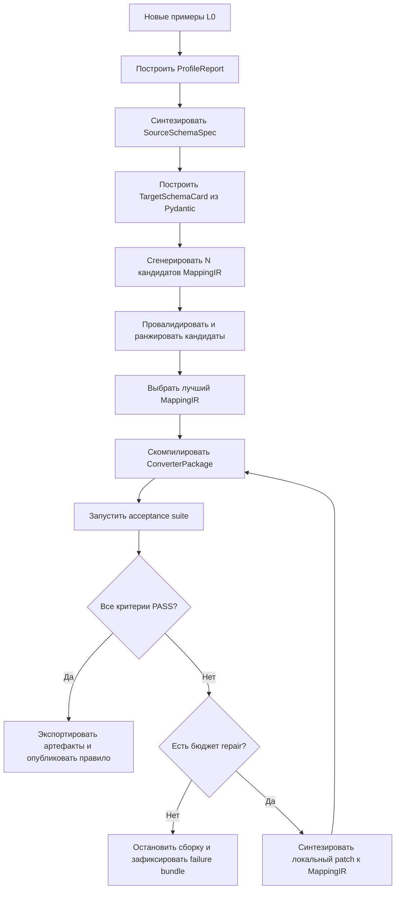
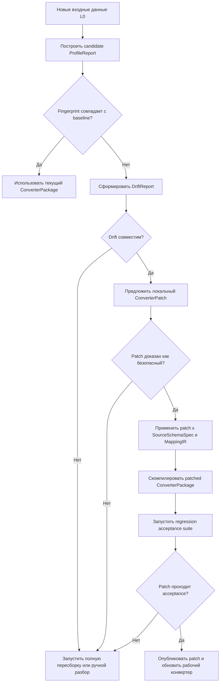

# Основные принципы работы `ai-converter`

Этот документ собирает в одном месте основные принципы библиотеки на основе постановки из [`tasks/large_task_llm_converter.md`](../tasks/large_task_llm_converter.md) и текущей структуры репозитория. Ниже под "правилом" понимается не свободный Python-код, а опубликованный набор артефактов `SourceSchemaSpec + MappingIR + ConverterPackage`, который можно воспроизводимо пересобирать, валидировать и патчить.

## 1. Что делает библиотека

`ai-converter` строит offline-first pipeline для перехода от внешнего формата `L0` (`CSV`, `JSON`, `JSONL`) к фиксированному `L1`, описанному через `Pydantic`. Ключевая идея библиотеки: LLM допускается только на этапе синтеза артефактов, а не в эксплуатационном runtime. После публикации конвертера преобразование новых записей выполняется детерминированным Python-кодом.

Текущий pipeline в кодовой базе выглядит так:

`ProfileReport -> SourceSchemaSpec -> TargetSchemaCard -> MappingIR -> ConverterPackage -> Acceptance/Repair -> DriftReport/ConverterPatch`

Этот контур уже отражен в репозитории:

- профилирование: [`src/ai_converter/profiling/`](../src/ai_converter/profiling/)
- schema contracts: [`src/ai_converter/schema/`](../src/ai_converter/schema/)
- prompt/rendering и адаптеры: [`src/ai_converter/llm/`](../src/ai_converter/llm/)
- `MappingIR`: [`src/ai_converter/mapping_ir/`](../src/ai_converter/mapping_ir/)
- компиляция и валидация: [`src/ai_converter/compiler/`](../src/ai_converter/compiler/), [`src/ai_converter/validation/`](../src/ai_converter/validation/)
- drift и patch adaptation: [`src/ai_converter/drift/`](../src/ai_converter/drift/)
- benchmark/evaluation: [`src/ai_converter/evaluation/`](../src/ai_converter/evaluation/)

## 2. Основные принципы и их обоснование

### 2.1. Compile-once важнее direct runtime prompting

Библиотека исходит из модели `compile once, run many`: LLM помогает один раз восстановить структуру источника и синтезировать правило преобразования, после чего дальнейшая эксплуатация опирается только на детерминированный `ConverterPackage`. Это зафиксировано и в постановке задачи, и в текущем коде компилятора и acceptance-слоя.

Почему это важно:

- стоимость и нестабильность LLM выносятся из runtime в стадию подготовки артефактов;
- эксплуатационное преобразование остается воспроизводимым;
- появляется возможность версионировать конвертер и отдельно валидировать его поведение.

Где это видно в репозитории:

- [`README.md`](../README.md)
- [`docs/architecture/compiler_and_validation.md`](architecture/compiler_and_validation.md)
- [`src/ai_converter/compiler/compiler.py`](../src/ai_converter/compiler/compiler.py)
- [`src/ai_converter/compiler/__init__.py`](../src/ai_converter/compiler/__init__.py)

Исследовательское обоснование:

- [Evaluating the Effectiveness of LLM-based Interoperability](https://arxiv.org/abs/2510.23893)
- [Automatic End-to-End Data Integration using Large Language Models](https://arxiv.org/abs/2603.10547)

### 2.2. Любой синтез начинается с детерминированного профилирования

LLM не должен получать "сырой" источник как единственный контекст. Сначала библиотека строит устойчивый `ProfileReport`: извлекает path-based признаки, статистики полей, representative samples и стабильный `schema_fingerprint`. Это уменьшает случайность входа и делает последующие стадии повторяемыми.

Почему это важно:

- профилирование отделяет структуру формата от конкретного распределения данных;
- `schema_fingerprint` позволяет обнаруживать drift без привязки к порядку строк;
- evidence-packing дает компактный и управляемый контекст вместо неконтролируемой передачи всего источника.

Где это видно в репозитории:

- [`docs/architecture/profiling.md`](architecture/profiling.md)
- [`src/ai_converter/profiling/fingerprint.py`](../src/ai_converter/profiling/fingerprint.py)
- [`src/ai_converter/schema/evidence_packer.py`](../src/ai_converter/schema/evidence_packer.py)

Исследовательское обоснование:

- [Towards Scalable Schema Mapping using Large Language Models](https://arxiv.org/abs/2505.24716)
- [ConStruM: A Structure-Guided LLM Framework for Context-Aware Schema Matching](https://arxiv.org/abs/2601.20482)

### 2.3. Между этапами передаются schema-first артефакты, а не свободный текст

Внутри библиотеки почти каждый важный переход оформлен как типизированный контракт: `ProfileReport`, `SourceSchemaSpec`, `TargetSchemaCard`, `MappingIR`, `PromptEnvelope`, `LLMResponse`, `AcceptanceReport`, `DriftReport`, `ConverterPatch`. Это означает, что библиотека управляет не "разговорами с моделью", а версиями структурированных артефактов.

Почему это важно:

- ошибки легче локализовать и проверять по границам артефактов;
- каждый этап можно тестировать отдельно без живой модели;
- появляется возможность хранить trace-артефакты и сравнивать их между запусками.

Где это видно в репозитории:

- [`docs/architecture/schema_contracts.md`](architecture/schema_contracts.md)
- [`src/ai_converter/schema/source_spec_models.py`](../src/ai_converter/schema/source_spec_models.py)
- [`src/ai_converter/schema/target_card_builder.py`](../src/ai_converter/schema/target_card_builder.py)
- [`src/ai_converter/llm/protocol.py`](../src/ai_converter/llm/protocol.py)

Исследовательское обоснование:

- [PARSE: LLM Driven Schema Optimization for Reliable Entity Extraction](https://doi.org/10.18653/v1/2025.emnlp-industry.184)
- [Schema First Tool APIs for LLM Agents](https://arxiv.org/abs/2603.13404)

### 2.4. LLM синтезирует ограниченный `MappingIR`, а не произвольный Python

Главное правило библиотеки: модель не пишет production-код напрямую. Она синтезирует `MappingIR`, а уже детерминированный компилятор превращает этот IR в Python-модуль. В репозитории этот подход зафиксирован и на уровне prompt layer, и на уровне validator/ranker, и на уровне runtime helpers.

Почему это важно:

- легче проверить корректность до компиляции;
- меньше риск получить синтаксически валидный, но семантически произвольный код;
- patching и repair применяются к небольшой программе на IR-уровне, а не ко всему модулю целиком.

Где это видно в репозитории:

- [`docs/prompts/mapping_ir.md`](prompts/mapping_ir.md)
- [`src/ai_converter/mapping_ir/synthesizer.py`](../src/ai_converter/mapping_ir/synthesizer.py)
- [`src/ai_converter/mapping_ir/validator.py`](../src/ai_converter/mapping_ir/validator.py)
- [`src/ai_converter/compiler/runtime_ops.py`](../src/ai_converter/compiler/runtime_ops.py)

Исследовательское обоснование:

- [Anka: A Domain-Specific Language for Reliable LLM Code Generation](https://arxiv.org/abs/2512.23214)
- [JSONSchemaBench: A Rigorous Benchmark of Structured Outputs for Language Models](https://arxiv.org/abs/2501.10868)

### 2.5. Валидация разделяется на структурную, исполнимую и семантическую

Для `ai-converter` недостаточно того, что ответ формально совпал с JSON schema. Конвертер должен:

1. исполняться без ошибок;
2. отдавать структурно валидный `L1`;
3. сохранять смысл полей и преобразований.

Именно поэтому acceptance-контур отделяет `execution_success`, `structural_validity` и `semantic_validity`, а repair loop опирается на failure bundles и повторную компиляцию.

Почему это важно:

- структурная валидность сама по себе не гарантирует корректную семантику;
- ошибку можно отнести либо к `MappingIR`, либо к runtime-операции, либо к семантическим assertions;
- bounded repair остается локальным и проверяемым.

Где это видно в репозитории:

- [`docs/architecture/compiler_and_validation.md`](architecture/compiler_and_validation.md)
- [`src/ai_converter/validation/structural.py`](../src/ai_converter/validation/structural.py)
- [`src/ai_converter/validation/semantic.py`](../src/ai_converter/validation/semantic.py)
- [`src/ai_converter/validation/acceptance.py`](../src/ai_converter/validation/acceptance.py)
- [`src/ai_converter/validation/repair_loop.py`](../src/ai_converter/validation/repair_loop.py)

Исследовательское обоснование:

- [JSONSchemaBench](https://arxiv.org/abs/2501.10868)
- [ExtractBench: A Benchmark and Evaluation Methodology for Complex Structured Extraction](https://arxiv.org/abs/2602.12247)
- [Draft-Conditioned Constrained Decoding for Structured Generation in LLMs](https://arxiv.org/abs/2603.03305)

### 2.6. Drift трактуется как отдельная задача сравнения и локального patching

После публикации правила библиотека не предполагает, что входной формат навсегда останется неизменным. Вместо полной регенерации с нуля она сначала строит `DriftReport`, затем пытается локально выпустить `ConverterPatch` и только после этого решает, нужен ли более тяжелый сценарий пересборки.

Важно, что текущая реализация drift-контура в репозитории пока heuristic-first и deterministic-first:

- `classify_drift(...)` сравнивает baseline и candidate профили;
- `propose_compatible_patch(...)` предлагает безопасный локальный patch;
- `apply_converter_patch(...)` изменяет `SourceSchemaSpec` и `MappingIR` без затрагивания несвязанных частей.

Почему это важно:

- мелкие совместимые изменения не должны сбрасывать весь накопленный конвертер;
- локальный patch проще провалидировать и проще откатить;
- drift становится наблюдаемым артефактом, а не неявной поломкой runtime.

Где это видно в репозитории:

- [`src/ai_converter/drift/classifier.py`](../src/ai_converter/drift/classifier.py)
- [`src/ai_converter/drift/heuristics.py`](../src/ai_converter/drift/heuristics.py)
- [`src/ai_converter/drift/models.py`](../src/ai_converter/drift/models.py)
- [`src/ai_converter/drift/patch_apply.py`](../src/ai_converter/drift/patch_apply.py)

Исследовательское обоснование:

- [JSON Whisperer: Efficient JSON Editing with LLMs](https://arxiv.org/abs/2510.04717)
- [AI-assisted JSON Schema Creation and Mapping](https://arxiv.org/abs/2508.05192)

### 2.7. Offline-first не означает "без LLM вообще"

Репозиторий намеренно устроен так, чтобы весь pipeline можно было тестировать offline: для тестов есть `FakeLLMAdapter`, а живой OpenAI-клиент подключается как опциональный адаптер по общему контракту `LLMAdapter`. Это значит, что библиотека не "зашита" в сеть, но и не отказывается от реальных модельных вызовов там, где они нужны для синтеза артефактов.

Почему это важно:

- unit/integration тесты не зависят от сети;
- behavior на fake и real adapter слое унифицирован trace-контрактами;
- можно централизованно ограничивать бюджет вызовов по стадиям `schema`, `mapping`, `repair`.

Где это видно в репозитории:

- [`src/ai_converter/llm/fake_client.py`](../src/ai_converter/llm/fake_client.py)
- [`src/ai_converter/llm/openai_adapter.py`](../src/ai_converter/llm/openai_adapter.py)
- [`src/ai_converter/llm/protocol.py`](../src/ai_converter/llm/protocol.py)

### 2.8. Наблюдаемость и версионирование встроены в архитектуру

Библиотека проектируется как набор воспроизводимых артефактов. Поэтому почти все важные сущности умеют экспортировать machine-readable следы: prompt traces, acceptance traces, repair traces, package manifest, benchmark reports. Это критично, если система должна не просто "сработать один раз", а поддерживать доверие к конвертеру на длинной дистанции.

Почему это важно:

- можно зафиксировать, какой prompt и какой ответ породили конкретный `MappingIR`;
- можно воспроизвести, почему repair loop остановился;
- benchmark и telemetry можно сравнивать между версиями конвертера.

Где это видно в репозитории:

- [`src/ai_converter/llm/protocol.py`](../src/ai_converter/llm/protocol.py)
- [`src/ai_converter/compiler/compiler.py`](../src/ai_converter/compiler/compiler.py)
- [`src/ai_converter/validation/repair_loop.py`](../src/ai_converter/validation/repair_loop.py)
- [`docs/evaluation/benchmark_protocol.md`](evaluation/benchmark_protocol.md)

## 3. Как принципы раскладываются по репозиторию

- `profiling/` отвечает за детерминированное описание входного формата и генерацию fingerprint.
- `schema/` превращает профиль в управляемые schema-first контракты и упаковывает evidence под бюджет.
- `llm/` отвечает за prompt rendering, trace contracts и адаптеры к fake/real LLM.
- `mapping_ir/` хранит промежуточный язык преобразования, валидирует кандидаты и ранжирует их.
- `compiler/` детерминированно переводит `MappingIR` в `ConverterPackage`.
- `validation/` измеряет структурную и семантическую корректность и запускает bounded repair.
- `drift/` сравнивает baseline и candidate представления источника и предлагает локальные patch-операции.
- `evaluation/` дает воспроизводимый benchmark-контур для сравнения конвертеров и baseline-решений.

## 4. Псевдокод: цикл построения правила

```text
function build_conversion_rule(source_samples, target_model, format_hint=None, conversion_hint=None):
    profile = build_profile_report(source_samples)

    source_schema_response = synthesize_source_schema(
        profile,
        budget=1800,
        mode="balanced",
        format_hint=format_hint,
    )
    assert source_schema_response.ok

    source_schema = normalize_source_schema_spec(source_schema_response.parsed)
    target_card = build_target_schema_card(target_model)

    mapping_result = synthesize_mapping(
        source_schema,
        target_card,
        candidate_count=3,
        conversion_hint=conversion_hint,
    )
    assert mapping_result.best_candidate is not None

    mapping_ir = mapping_result.best_candidate
    package = compile_mapping_ir(mapping_ir)
    report = run_acceptance_suite(package.convert, acceptance_dataset, target_model)

    repair_attempts = 0
    while not (
        report.execution_success
        and report.structural_validity
        and report.semantic_validity
    ):
        if repair_attempts >= max_repair_iterations:
            raise BuildFailed("acceptance criteria are not satisfied")

        failure_bundle = build_failure_bundle(mapping_ir, report, repair_attempts)
        patched_mapping_ir = repair_strategy.propose_patch(mapping_ir, failure_bundle)
        if patched_mapping_ir is None:
            raise BuildFailed("repair strategy declined to patch")

        mapping_ir = patched_mapping_ir
        package = compile_mapping_ir(mapping_ir)
        report = run_acceptance_suite(package.convert, acceptance_dataset, target_model)
        repair_attempts += 1

    export(source_schema, mapping_ir, package, traces=all_trace_artifacts)
    return package
```

## 5. Mermaid: цикл построения правила



## 6. Псевдокод: обнаружение drift и применение patch

```text
function handle_drift(candidate_samples, baseline_report, source_schema, mapping_ir, target_model):
    candidate_report = build_profile_report(candidate_samples)

    if candidate_report.schema_fingerprint == baseline_report.schema_fingerprint:
        return UseCurrentConverter

    drift_report = classify_drift(
        baseline_report,
        candidate_report,
        baseline_schema=source_schema,
    )

    if not drift_report.compatible:
        return RequireFullRegeneration(drift_report)

    resolution = propose_compatible_patch(drift_report, source_schema, mapping_ir)
    if not resolution.compatible or resolution.patch is None:
        return RequireFullRegeneration(drift_report)

    patched_source_schema, patched_mapping_ir = apply_converter_patch(
        source_schema,
        mapping_ir,
        resolution.patch,
    )

    patched_package = compile_mapping_ir(patched_mapping_ir)
    patched_report = run_acceptance_suite(
        patched_package.convert,
        regression_dataset,
        target_model,
    )

    if (
        patched_report.execution_success
        and patched_report.structural_validity
        and patched_report.semantic_validity
    ):
        publish_patch(drift_report, resolution.patch, patched_source_schema, patched_mapping_ir)
        return UsePatchedConverter(patched_package)

    return RequireFullRegeneration(drift_report)
```

## 7. Mermaid: обнаружение drift и применение patch



## 8. Какие patch-операции реально предусмотрены сейчас

Текущий drift-слой работает не с абстрактным "исправь что-нибудь", а с явными patch-операциями:

- для `SourceSchemaSpec`: `AddSourceFieldOperation`, `AddSourceAliasOperation`, `UpdateSourceFieldOperation`
- для `MappingIR`: `RetargetSourceRefOperation`, `AddSourceReferenceOperation`, `PromoteStepToCastOperation`, `ExtendEnumMappingOperation`

Это хороший индикатор того, что библиотека уже ориентирована на локальную эволюцию правила, а не на полную регенерацию при любом изменении формата.

## 9. Источники

### 9.1. Локальные источники по текущей реализации

- постановка и архитектурная мотивация: [`tasks/large_task_llm_converter.md`](../tasks/large_task_llm_converter.md)
- общий обзор библиотеки: [`README.md`](../README.md)
- профилирование: [`docs/architecture/profiling.md`](architecture/profiling.md)
- schema contracts: [`docs/architecture/schema_contracts.md`](architecture/schema_contracts.md)
- prompt layer и `MappingIR`: [`docs/prompts/mapping_ir.md`](prompts/mapping_ir.md)
- компилятор и валидация: [`docs/architecture/compiler_and_validation.md`](architecture/compiler_and_validation.md)
- benchmark/evaluation: [`docs/evaluation/benchmark_protocol.md`](evaluation/benchmark_protocol.md)
- drift classification: [`src/ai_converter/drift/classifier.py`](../src/ai_converter/drift/classifier.py)
- heuristic patching: [`src/ai_converter/drift/heuristics.py`](../src/ai_converter/drift/heuristics.py)
- patch application: [`src/ai_converter/drift/patch_apply.py`](../src/ai_converter/drift/patch_apply.py)

### 9.2. Внешние источники для обоснования принципов

- [Evaluating the Effectiveness of LLM-based Interoperability](https://arxiv.org/abs/2510.23893)
- [Automatic End-to-End Data Integration using Large Language Models](https://arxiv.org/abs/2603.10547)
- [Towards Scalable Schema Mapping using Large Language Models](https://arxiv.org/abs/2505.24716)
- [ConStruM: A Structure-Guided LLM Framework for Context-Aware Schema Matching](https://arxiv.org/abs/2601.20482)
- [PARSE: LLM Driven Schema Optimization for Reliable Entity Extraction](https://doi.org/10.18653/v1/2025.emnlp-industry.184)
- [Schema First Tool APIs for LLM Agents](https://arxiv.org/abs/2603.13404)
- [JSONSchemaBench: A Rigorous Benchmark of Structured Outputs for Language Models](https://arxiv.org/abs/2501.10868)
- [ExtractBench: A Benchmark and Evaluation Methodology for Complex Structured Extraction](https://arxiv.org/abs/2602.12247)
- [Draft-Conditioned Constrained Decoding for Structured Generation in LLMs](https://arxiv.org/abs/2603.03305)
- [Anka: A Domain-Specific Language for Reliable LLM Code Generation](https://arxiv.org/abs/2512.23214)
- [JSON Whisperer: Efficient JSON Editing with LLMs](https://arxiv.org/abs/2510.04717)
- [AI-assisted JSON Schema Creation and Mapping](https://arxiv.org/abs/2508.05192)
